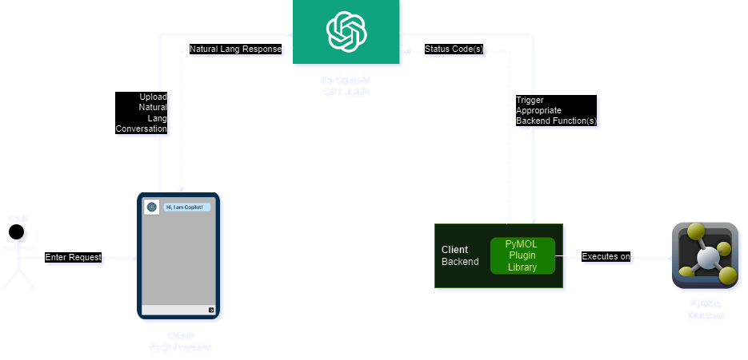

# PyMOL Copilot
#### An AI Assistant for the PyMOL molecular visualization software
Abdul Lateef FNU, Arqam Usman Ali, Sriram Koyalkar, Saipranith Oku

<p>
  
</p>

# Installation

1. **To get started make sure you have the PyMOL application [installed](https://pymol.org/2/ "Install"), clone the plugin repo from inside desired working directory:**

```shell
git clone https://github.com/abdullateefv/PyMolCopilot.git
```

2. **Set up your conda environment after making sure you have Anaconda [installed](https://docs.conda.io/projects/conda/en/latest/user-guide/install/index.html "Install"):**

```shell
cd PyMolCopilot
conda env create -f environment.yml
conda activate pymolEnv
```

Anytime you run the plugin be sure to use the appropriate env to include project dependencies by using

```shell 
conda activate pymolEnv
``` 

3. **Add the .env file with API Key to the project files in the top-level directory**

4. **Execute the terminal command:**

```commandline
pymol
```

5. **The PyMOL application should launch. Load the plugin into PyMOL:**

    - Navigate to the `Plugin` menu at the top.
    - Select `Plugin Manager` from the dropdown.
    - Go to the `Install New Plugin` tab.
    - Choose `Install from local file`.
    - Select the `__init__.py` file in the project files top-level folder, click Open


6. **Specify the directory to install the plugin files in, click Ok, close Plugin Manager window**
   - *These files will need to be deleted and reinstalled from step 4 to see new code modification changes*

 
7. **Launch Plugin:**

    - Navigate to the `Plugin` menu at the top.
    - Select `PyMol Copilot` from the dropdown.

# File Structure
```
PymolCopilot/  
├── backend/  
│   ├── toolsDescription.json  
│   ├── appearanceFunctions.py  
│   ├── weatherFunctions.py  
│   └── ...  
├── frontend/ 
│   ├── chatWindowComponent/  
│   │   ├── chatWindowController.py  
│   │   ├── chatWindowStyle.qss
│   │   ├── chatWindowView.ui
│   │   └── ...  
│   └── ...  
├── utilities/  
│   ├── runConversation.py  
│   └── ...  
├── .env  
├── .gitignore  
├── __init__.py  
├── environment.yml  
├── README.md
└── title.jpg
```

- Backend directory holds function modules made available to Copilot for invocation to fulfill user requests
    - Functions grouped into .py modules by common theme
    - toolsDescription.json describes each function's usage to Copilot
      - *Must update with each new function added*
- Frontend directory holds UI components
  - Each have a Qt .ui XML Structure File, a .qss stylesheet file, and a .py controller file
  - Grouped into components where each component is an application window
- Utilities holds middleware & functions used across application
  - Includes communication and data processing logic for OpenAI API/GPT interfacing

# Architecture

<p>
  
</p>
